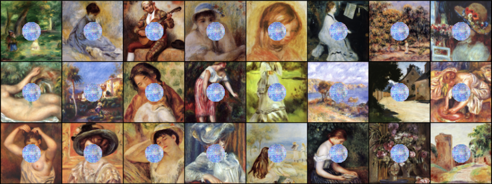

# context_encoder
Context Encoder for Image Inpainting using Pytorch

## Results
Based On: https://github.com/BoyuanJiang/context_encoder_pytorch/tree/master

Inpainting trained on singular random mask generated by Perlin Noise. Tested on same random mask. After 200 epochs of training. 

Inpainting trained on on singular random mask generated by Perlin Noise. Tested on circle. After 200 epochs of training. 

## How to Run
To Train

`python3 train.py --wtl2 0.999 --niter 200 --cuda`

To Test 

`python3 test.py --netG model/netG_streetview.pth --dataroot dataset/val --batchSize 100`
