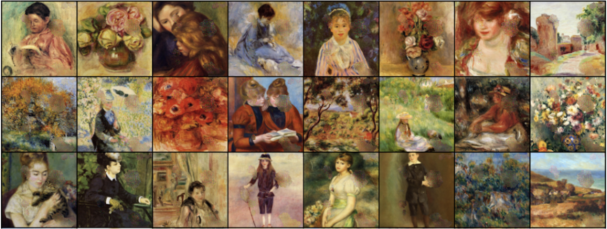

# context_encoder
Context Encoder for Image Inpainting using Pytorch

Based On: https://github.com/BoyuanJiang/context_encoder_pytorch/tree/master

To Train

`python3 train.py --wtl2 0.999 --niter 200 --cuda`

To Test 

`python3 test.py --netG model/netG_streetview.pth --dataroot dataset/val --batchSize 100`
