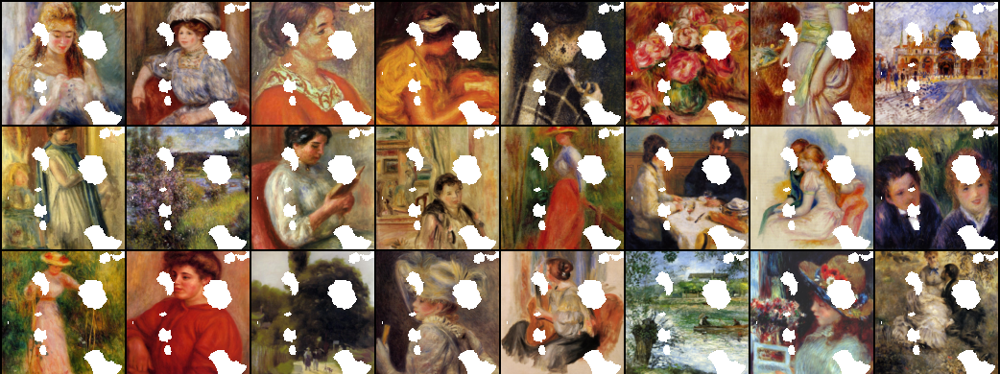

# Image Inpainting GAN for Art Restoration using Context Encoders
### Using Pytorch

The problem of Image Inpainting aims to reconstruct missing parts of images. For this Independent Study, I have analyzed the Image Inpainting task to restore damaged artwork. I chose art restoration as my area of focus based on my previous coursework studying medieval art when I studied abroad in Siena, Italy. Much of the art produced during that period was made with fragile plaster, which is subject to damage over time. I was inspired by the damaged sections of art to tackle the problem using deep learning. 

Inspired by [Deepak Pathak, Philipp Krahenbuhl, Jeff Donahue, Trevor Darrell, Alexei A. Efros' 2016 Paper](https://arxiv.org/abs/1604.07379)

Based On this [Code in Pytorch](https://github.com/BoyuanJiang/context_encoder_pytorch/tree/master)

## Results

This is an example of the cropped images to be inpainted by my system.

Inpainting trained on a singular random mask generated by Perlin Noise and tested on the same random mask. After 200 epochs of training. 

Inpainting trained on on singular random mask generated by Perlin Noise and tested on a circle. After 200 epochs of training. 

As evident from the results above, this system can accomplish image inpainting for art restoration when training on the same mask that is being tested. Results decline when testing on a different mask than what was trained on. 

## Data
The dataset contains around 1,000 images of Renoir's impressionist paintings for training and 100 for testing. Obtained from [WikiArt Dataset](https://github.com/cs-chan/ArtGAN/tree/master/WikiArt%20Dataset) 

## How to Run
To Train

`python3 train.py --wtl2 0.999 --niter 200 --cuda`

To Test 

`python3 test.py --netG model/netG_streetview.pth --dataroot dataset/val --batchSize 100`

## Loss
`my_plot.png` plots the losses for the generator, discriminator on fake images, and discriminator on real images. 
